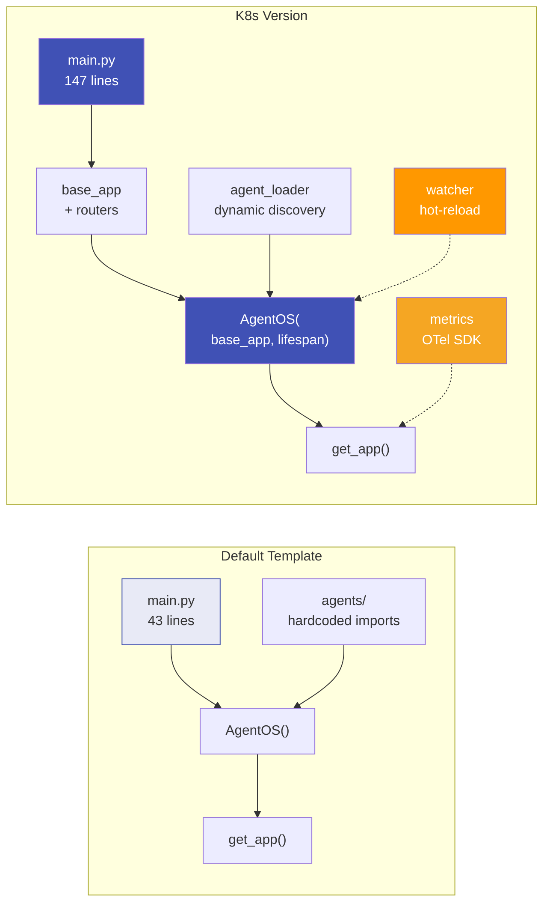
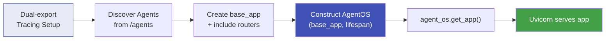
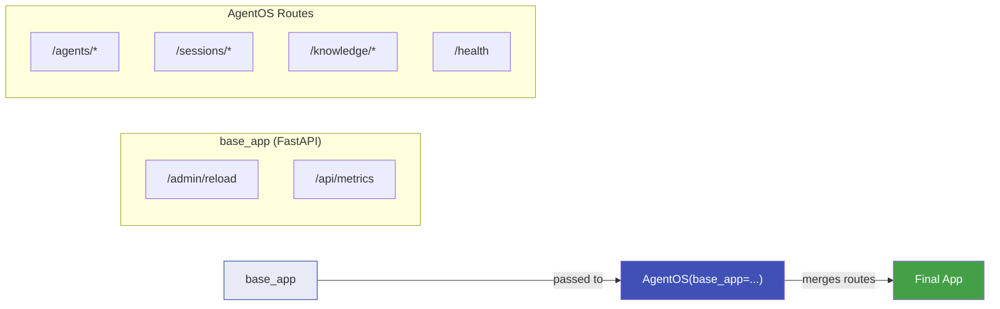
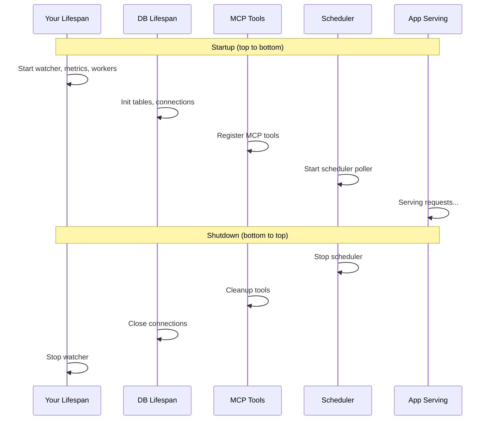
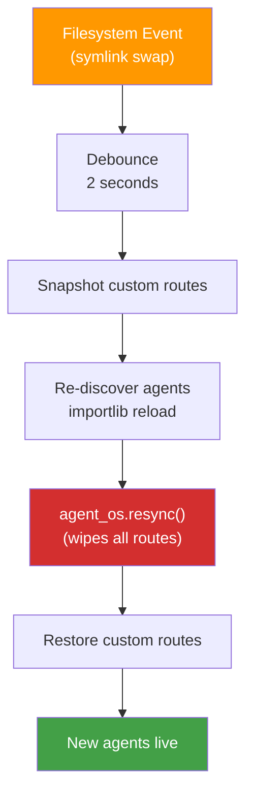
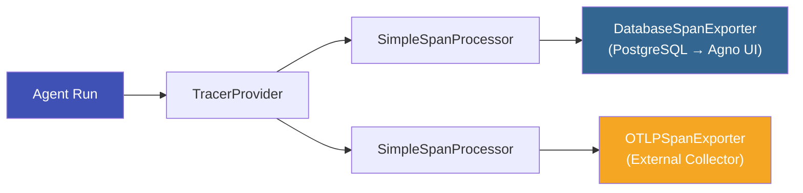

# Agno Architecture

This document describes the Agno AgentOS framework patterns used in this deployment and the architectural decisions behind them.

## Overview

[AgentOS](https://docs.agno.com/agent-os) is a FastAPI-based runtime for managing AI agents built with the [Agno](https://github.com/agno-agi/agno) framework. It provides:

- Agent lifecycle management (load, register, serve via API)
- Session and knowledge management (PostgreSQL-backed)
- MCP (Model Context Protocol) tool integration
- Health checks, scheduling, and auto-discovery

This repository implements AgentOS following Agno's recommended patterns rather than the monolithic approach that often evolves in POC deployments.

## What Changed from the Default AgentOS

The upstream [agentos-docker-template](https://github.com/agno-agi/agentos-docker-template) is a minimal starter — 43 lines of `main.py`, two hardcoded agents, and a Docker Compose dev workflow. This repository restructures it for production Kubernetes deployment while preserving the same base image and entrypoint.

### Architecture Comparison



### Side-by-Side: Application Structure

| Aspect | Default Template | K8s Version |
|--------|-----------------|-------------|
| **`main.py`** | 43 lines — construct AgentOS, call `get_app()` | 147 lines — tracing setup, agent discovery, lifespan, `base_app` pattern |
| **Agent loading** | Static imports (`from agents.knowledge_agent import ...`) | Dynamic discovery via `importlib` from `/agents` volume |
| **Agent source** | Baked into container image (`agents/` directory in Docker context) | Delivered at runtime via git-sync sidecar (shared `emptyDir` volume) |
| **Hot-reload** | None — requires container restart | Filesystem watcher + symlink poller detects changes within seconds |
| **Custom routes** | None — only AgentOS built-in routes | `base_app` pattern with `APIRouter` modules (`/admin/*`, `/api/*`) |
| **Lifespan** | Framework default (no custom lifespan) | Constructor-injected lifespan (watcher, metrics, daemon threads) |
| **Tracing** | Framework default (DB exporter only via `tracing=True`) | Dual-export: DB exporter + OTLP exporter to external collector |
| **Metrics** | None | Full OTel SDK: counters, histograms, gauges pushed via OTLP gRPC |
| **Route conflict** | Not configured | `on_route_conflict="preserve_base_app"` |
| **File structure** | Flat: `app/main.py`, `agents/`, `db/`, `scripts/` | Modular: `app/main.py`, `app/routers/`, `app/shared.py`, `app/watcher.py`, `app/metrics.py`, `app/agent_loader.py` |

### Side-by-Side: Container & Deployment

| Aspect | Default Template | K8s Version |
|--------|-----------------|-------------|
| **Base image** | `agnohq/python:3.12` | `agnohq/python:3.12` (identical) |
| **User** | UID 61000, non-root | UID 61000, non-root (identical) |
| **Entrypoint** | `entrypoint.sh` with banner, `WAIT_FOR_DB`, chill mode | Identical `entrypoint.sh` |
| **Default CMD** | `chill` (sleep loop — manual start) | `uvicorn app.main:app --host 0.0.0.0 --port 8000` (auto-start) |
| **COPY strategy** | `COPY . .` (entire repo including agents) | `COPY src/ .` (app code only, no agents) |
| **`/agents` volume** | Not present — agents are in the image | `mkdir -p /agents && chown app:app /agents` — mount point for git-sync |
| **Dependencies** | 90 packages (core framework only) | 157 packages (+67 for observability, data processing, document parsing) |
| **Dev workflow** | Docker Compose, build/format/validate scripts, `example.env` | Kubernetes-only: Helm chart, GitHub Actions CI/CD |
| **Deployment** | Single container via `docker compose up` | Multi-container pod (AgentOS + git-sync sidecar), Helm-managed |
| **Scaling** | Single instance | Horizontal: multiple replicas behind Istio/Service |
| **Secrets** | `example.env` file, manual | External Secrets Operator (Keeper, AWS SSM, Vault, etc.) |

### Key Additions (Not in Default Template)

These modules are entirely new — they have no equivalent in the upstream template:

| Module | Lines | Purpose |
|--------|-------|---------|
| `agent_loader.py` | 139 | Dynamic agent discovery via `importlib` — scans `/agents` for Python files, collects `Agent` instances, handles `.env` loading and module reloading |
| `watcher.py` | 258 | Filesystem watcher (`watchdog`) + symlink poller for git-sync — debounced reload, route snapshot/restore through `resync()` |
| `metrics.py` | 226 | Full OTel metrics SDK — counters, histograms, observable gauges for webhooks, agents, queues, DB tables; OTLP gRPC push exporter |
| `shared.py` | 64 | Cross-cutting state shared by routers — `agent_os` reference, webhook auth, agent lookup |
| `routers/admin.py` | 55 | Admin endpoints — `/admin/reload` for manual agent resync |
| `routers/observability.py` | 57 | Debug metrics endpoint (`/api/metrics`) + background DB size collector |

### Dependency Additions

The K8s version adds ~67 packages on top of the default template's 90:

| Category | Key Packages | Why |
|----------|-------------|-----|
| **Observability** | `arize-phoenix-client`, `opentelemetry-exporter-otlp-proto-grpc`, `opentelemetry-exporter-otlp-proto-http`, `sentry-sdk` | Dual-export tracing (DB + OTLP), Phoenix evals, error tracking |
| **Data processing** | `pandas`, `pyarrow`, `tabulate` | Agent data analysis and transformation |
| **Document parsing** | `beautifulsoup4`, `lxml`, `pypdf`, `python-docx`, `openpyxl`, `odfpy` | Agents that process uploaded documents |
| **HTTP** | `aiohttp`, `requests` | Webhook callbacks, external API calls |
| **Image** | `Pillow` | Image processing in agent workflows |
| **File watching** | `watchdog` | Filesystem watcher for hot-reload |

### What Stayed the Same

These elements are identical or functionally equivalent between the default template and the K8s version:

- **Base image** — `agnohq/python:3.12` (same Agno-maintained Python image)
- **Non-root user** — UID/GID 61000, same `groupadd`/`useradd` commands
- **Entrypoint script** — Identical `entrypoint.sh` (banner, `WAIT_FOR_DB`, chill mode)
- **Database module** — `db/session.py` with `get_postgres_db()` using `POSTGRES_URL` and `PGVECTOR_DB_URL`
- **AgentOS constructor** — Same core parameters (`name`, `tracing`, `scheduler`, `scheduler_base_url`, `db`, `config`)
- **Config format** — Same `config.yaml` for AgentOS settings
- **Package installer** — `uv pip sync requirements.txt --system`

## Application Bootstrap Flow



## Four Pillars

### 1. `base_app` Pattern

AgentOS accepts a `base_app` parameter — a custom FastAPI application with your own routes. This cleanly separates your webhook handlers and admin endpoints from AgentOS's internal routes.

```python
base_app = FastAPI(title="AgentOS")
base_app.include_router(admin.router)
base_app.include_router(observability.router)

agent_os = AgentOS(
    agents=agents,
    base_app=base_app,
    on_route_conflict="preserve_base_app",
)
app = agent_os.get_app()
```

**Why `on_route_conflict="preserve_base_app"`**: Your routes (`/api/*`, `/admin/*`) don't overlap with AgentOS routes (`/agents/*`, `/sessions/*`, `/knowledge/*`, `/health`), so the conflict handler rarely fires. Setting it explicitly documents intent and protects against future AgentOS releases adding overlapping routes.



### 2. Constructor Lifespan

Startup and shutdown logic is passed to the `AgentOS()` constructor via the `lifespan` parameter — not monkey-patched after construction.

```python
@asynccontextmanager
async def lifespan(app_instance: FastAPI):
    observer = start_watcher(AGENTS_DIR, agent_os, app_instance)
    setup_otlp_metrics()
    # ... start daemon threads ...
    yield
    stop_watcher(observer)

agent_os = AgentOS(
    lifespan=lifespan,
    # ...
)
```

When `lifespan` is passed at construction, `get_app()` calls `_add_agent_os_to_lifespan_function()` which inspects the function signature. If your lifespan accepts an `agent_os` parameter, the framework injects the `AgentOS` instance automatically.

**Lifespan composition order** (from the `base_app` branch of `get_app()`):

1. Your lifespan (startup)
2. DB lifespan
3. MCP tools lifespan
4. httpx cleanup
5. Scheduler lifespan
6. *yield* (app is serving)
7. Scheduler shutdown
8. httpx cleanup
9. MCP tools cleanup
10. DB cleanup
11. Your lifespan (shutdown)

Your lifespan wraps everything — it starts before framework resources initialize and stops after they close.



### 3. Dynamic Agent Loader + Watcher

Agents are **not baked into the container image**. They are plain Python files delivered via git-sync and discovered at runtime using `importlib`.

```
/agents/
├── my_agent.py          # Agent module
├── another_agent.py     # Another agent
├── helpers/
│   ├── __init__.py      # Package with agents
│   └── utils.py
└── .env                 # Shared secrets (loaded before agent import)
```

The `agent_loader.py` module:
1. Loads `.env` from the agents directory (if present)
2. Scans for `*.py` files (skipping `_`-prefixed names)
3. Imports each as a module, collecting top-level `Agent` instances
4. Reloads previously-imported modules so code changes take effect

The `watcher.py` module uses `watchdog` to monitor the agents directory:
- **Debounced reload** (2 seconds) prevents rapid-fire reloads during git-sync writes
- **Symlink poller** detects git-sync worktree swaps that inotify cannot see

#### Route Snapshot/Restore

**Critical invariant**: `AgentOS.resync()` unconditionally clears all routes in `_reprovision_routers()`. Using `base_app` alone does NOT fix this — the route-wiping happens regardless.

The watcher snapshots custom routes before resync and restores them after, using an **exclude-list** of AgentOS-owned prefixes:

```python
AGENTOS_PREFIXES = (
    "/agents/", "/sessions/", "/knowledge/",
    "/health", "/docs", "/openapi.json", "/mcp",
)

# Snapshot: everything NOT matching these prefixes is custom
custom_routes = [
    route for route in app.router.routes
    if hasattr(route, "path")
    and not any(route.path.startswith(p) for p in AGENTOS_PREFIXES)
]
```

This is more defensive than an include-list — new custom routes are automatically preserved without filter updates.



### 4. Daemon Threads in Lifespan

Long-running persistent workers (triage queues, metrics collectors, etc.) use `threading.Thread(daemon=True)` started **inside the lifespan**, not at import time.

```python
@asynccontextmanager
async def lifespan(app_instance: FastAPI):
    # Workers start only when the app is serving
    threading.Thread(target=collect_db_metrics_loop, daemon=True).start()
    yield
```

**Why daemon threads over asyncio tasks**: Workers that call `agent.arun()` need their own event loops because MCP tools use blocking SSE transports. Running these on the main uvicorn loop would block it. The thread-per-worker model with disposable event loops is the correct pattern.

**Why not import-time**: Starting workers at import time means importing `main.py` in tests spawns threads. Moving them to the lifespan eliminates import-time side effects.

## Tracing Architecture

AgentOS uses dual-export tracing:

1. **Database exporter** — `DatabaseSpanExporter` writes spans to PostgreSQL for the Agno UI
2. **OTLP exporter** — sends spans to an external collector (Phoenix, Grafana, Datadog, etc.)

Both exporters are wired into the same `TracerProvider` via `SimpleSpanProcessor`, so every span goes to both destinations.



## Agent Packaging Model

- **No per-agent Helm charts** — all agents share a single AgentOS deployment
- **No agent code in the container image** — agents live in a separate Git repository
- **git-sync sidecar** delivers agent code to `/agents` via an `emptyDir` shared volume
- **Hot-reload** picks up changes within seconds of a git push

This means you can update agent behavior (prompts, tools, logic) without rebuilding or redeploying the AgentOS container.

## Metrics

The `metrics.py` module defines pure OpenTelemetry SDK instruments:

| Type | Name | Description |
|------|------|-------------|
| Counter | `agno.webhook.requests` | Total webhook requests |
| Counter | `agno.agent.runs` | Total agent runs |
| Counter | `agno.dedup.decisions` | Dedup hit/miss |
| Histogram | `agno.webhook.duration` | Webhook processing time |
| Histogram | `agno.agent.duration` | Agent run duration |
| UpDownCounter | `agno.agent.in_progress` | Active agent runs |
| Observable Gauge | `agno.agents.loaded` | Loaded agent count |
| Observable Gauge | `agno.queue.depth` | Queue depths |
| Observable Gauge | `agno.db.table.size` | Postgres table sizes |
| Observable Gauge | `agno.db.table.rows` | Approximate row counts |

When `OTEL_EXPORTER_OTLP_METRICS_ENDPOINT` is set, metrics are pushed via OTLP gRPC every 30 seconds. When unset, all instruments are no-ops with zero runtime cost.
