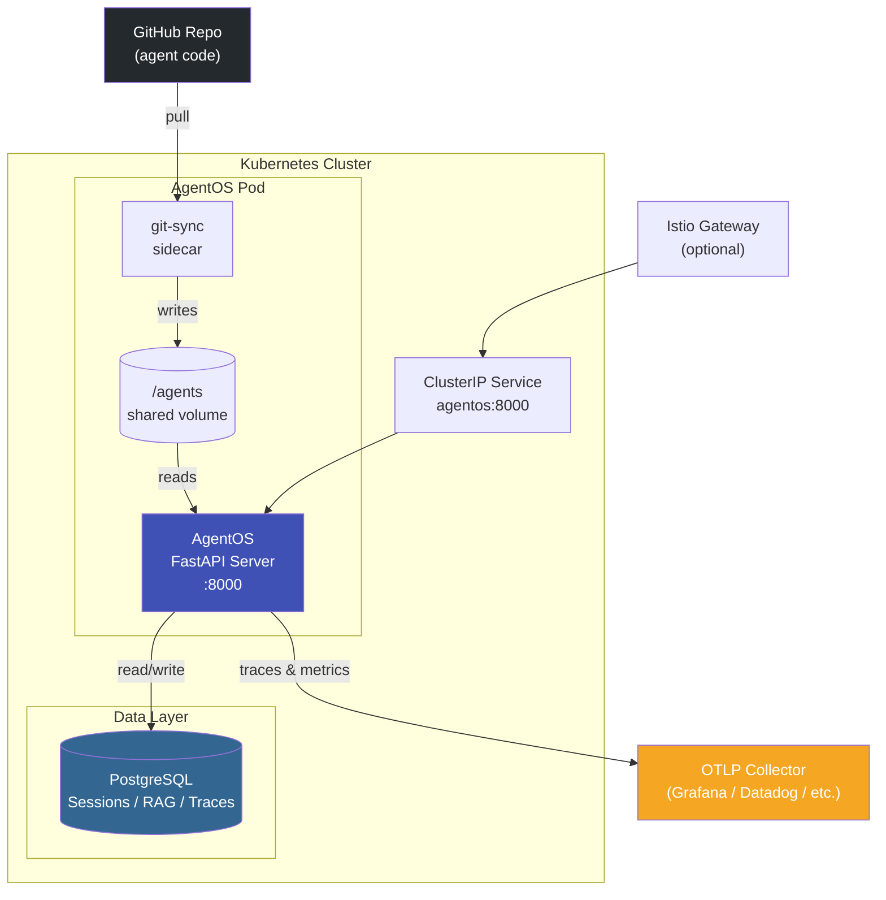
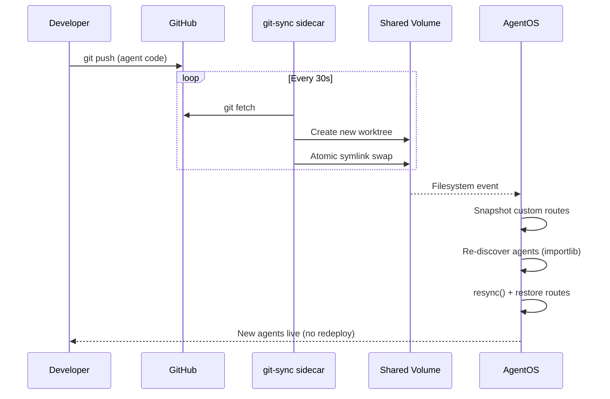

# AgentOS on Kubernetes

A production-grade reference implementation for deploying [Agno AgentOS](https://docs.agno.com/agent-os) on Kubernetes.

## Overview

This project demonstrates how to run AgentOS in a production Kubernetes environment using Agno's native patterns:

- **`base_app` pattern** — custom FastAPI app passed to AgentOS constructor
- **Constructor lifespan** — startup/shutdown logic composed with framework lifespans
- **Dynamic agent loading** — agents discovered at runtime from a git-sync volume
- **Route snapshot/restore** — custom routes preserved through AgentOS resync cycles

## System Overview

## How Agent Code Gets to the Pod

## Quick Links

- [Agno Architecture](agno-architecture.md) — framework patterns and design decisions
- [Kubernetes Deployment](kubernetes-deployment.md) — deployment model, scaling, and operations
- [GitHub Repository](https://github.com/k8s-engineering/agno-k8s)
- [Agno Documentation](https://docs.agno.com) — official Agno framework docs
