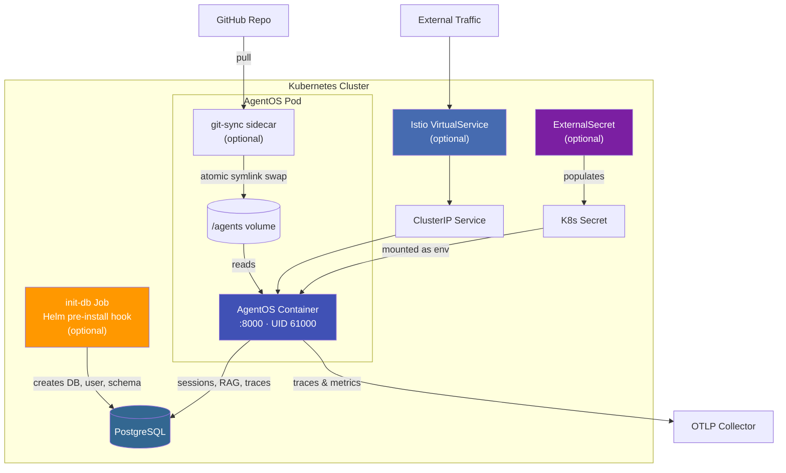
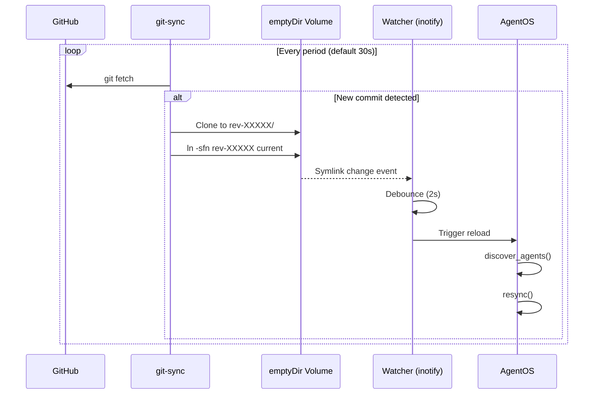
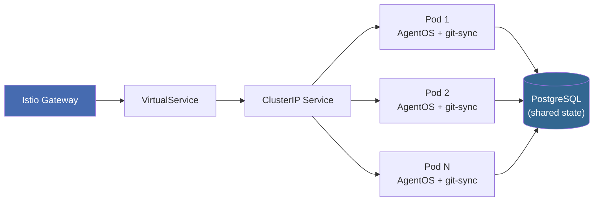
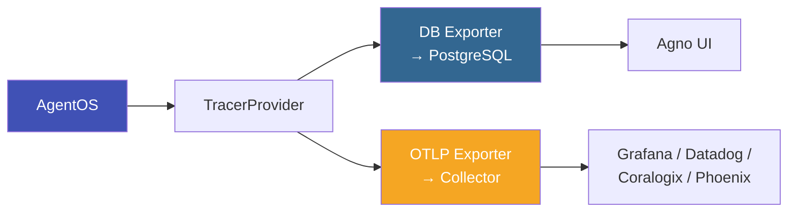

# Kubernetes Deployment

This document describes the Kubernetes deployment model for AgentOS, including scaling, secrets management, and operational patterns.

## Deployment Architecture

Each AgentOS pod contains two containers:

1. **AgentOS Container** — the main FastAPI server (`ghcr.io/k8s-engineering/agno-k8s/agentos`, port 8000, UID 61000)
2. **Git-Sync Sidecar** (optional) — pulls agent code from Git into a shared volume

A ClusterIP Service fronts the pods. Optionally, an Istio VirtualService routes external traffic through a gateway.

External dependencies:
- **PostgreSQL (RDS)** — agent sessions, knowledge/RAG tables (ai schema), trace storage
- **OTLP Collector** — receives traces and metrics (Coralogix, Grafana, Datadog, Phoenix, etc.)



## Feature Flags

The Helm chart uses simple boolean flags to toggle optional components:

### Istio (`istio.enabled`)

When enabled, creates an Istio VirtualService that routes external traffic through an Istio gateway to the AgentOS service.

```yaml
istio:
  enabled: true
  gateway: "istio-ingress/default-gateway"
  hostname: "agentos.example.com"
  timeout: "3600s"
```

### Init Database (`initDb.enabled`)

When enabled, creates a Kubernetes Job (Helm pre-install hook) that:

1. Creates the agno database if it doesn't exist
2. Creates the application user with the configured password
3. Creates the ai schema for PgVector/RAG tables
4. Enables the vector extension
5. Grants appropriate privileges

```yaml
initDb:
  enabled: true
  image: postgres:17-alpine
  adminCredentials:
    secretName: "rds-credentials"
    usernameKey: "username"
    passwordKey: "password"
```

### Git-Sync (`gitSync.enabled`)

When enabled, adds the git-sync sidecar container and shared volume to the pod.

```yaml
gitSync:
  enabled: true
  repo: "https://github.com/your-org/your-agents.git"
  branch: "main"
  subPath: "agents"
  period: "30s"
  auth:
    username: "x-access-token"
    secretName: "git-credentials"
    secretKey: "token"
```

The git-sync sidecar writes to an emptyDir shared volume. The AgentOS container reads from this volume at /agents. When git-sync detects a new commit, it creates a new worktree directory and atomically swaps the symlink. The AgentOS filesystem watcher detects this and triggers a reload.



### External Secrets (`externalSecrets.enabled`)

When enabled, creates ExternalSecret resources that fetch secrets from an external provider and populate a Kubernetes Secret.

The chart supports any provider that has an External Secrets Operator SecretStore: Keeper, AWS SSM, HashiCorp Vault, Azure Key Vault, GCP Secret Manager, etc.

```yaml
externalSecrets:
  enabled: true
  targetSecretName: "agentos-secrets"
  refreshInterval: "48h"
  secretStoreRef:
    name: "keeper-store"
    kind: "SecretStore"
  secrets:
    openai_api_key:
      remoteRef:
        key: "<keeper-record-id>"
        property: "password"
    jira_token:
      remoteRef:
        key: "<keeper-record-id>"
        property: "password"
```

#### Multi-Provider Support

The secrets map is provider-agnostic. The remoteRef fields map directly to the External Secrets Operator API. Different providers use different key formats:

| Provider | remoteRef.key format | remoteRef.property |
|----------|---------------------|-------------------|
| Keeper | Record ID (e.g. sLXJGAObJv9bZauWHdm4hA) | password, login, etc. |
| AWS SSM | Parameter path (e.g. /prod/db/password) | n/a |
| AWS Secrets Manager | Secret name (e.g. prod/myapp/secrets) | JSON key |
| HashiCorp Vault | Path (e.g. secret/data/myapp) | JSON key |
| Azure Key Vault | Secret name | n/a |

#### RDS Credentials

A separate ExternalSecret can be configured for RDS admin credentials (used by the init-db job). This typically uses a different SecretStore (e.g. ClusterSecretStore backed by AWS SSM).

```yaml
externalSecrets:
  rdsCredentials:
    enabled: true
    secretStoreRef:
      name: "external-secrets-store"
      kind: "ClusterSecretStore"
    target:
      name: "rds-credentials"
    remoteRef:
      usernameKey: "/prod/database/username"
      passwordKey: "/prod/database/password"
```

## Database

AgentOS uses PostgreSQL with the pgvector extension for:

- **Agent sessions and state** managed by Agno in the public schema
- **Knowledge/RAG tables** PgVector embeddings in the ai schema
- **Trace storage** DatabaseSpanExporter writes OTel spans for the Agno UI

### Connection URL Convention

The Helm chart auto-generates PostgreSQL URLs from the database values:

    {driver}://{appUser}:{password}@{host}:{port}/{name}

Three URL variants are injected as environment variables:

| Env Var | Format | Usage |
|---------|--------|-------|
| POSTGRES_URL | postgresql+psycopg://... | SQLAlchemy (with psycopg driver) |
| POSTGRES_RAW_URL | postgresql://... | Raw connections (psql, migrations) |
| PGVECTOR_DB_URL | postgresql+psycopg://... | PgVector operations |

## Scaling

### Multi-Replica

AgentOS pods are stateless. All persistent state lives in PostgreSQL. You can scale horizontally by increasing replicaCount or using a HorizontalPodAutoscaler.

With Istio enabled, traffic is automatically load-balanced across replicas.



**Important**: If your agents use in-memory dedup or caching (e.g. webhook dedup windows), you will need to centralize that state in Redis or PostgreSQL for multi-replica deployments.

### Resource Defaults

```yaml
resources:
  requests:
    cpu: "1"
    memory: "2Gi"
```

Adjust based on your agent workloads. LLM-heavy agents may need more memory; CPU-bound agents may need more CPU.

## Health Checks

The Helm chart configures both liveness and readiness probes against the built-in /health endpoint:

- **Liveness**: initialDelaySeconds: 30, periodSeconds: 15
- **Readiness**: initialDelaySeconds: 15, periodSeconds: 10

## Security

- **Non-root**: All containers run as UID 61000
- **Read-only filesystem**: Can be enabled via securityContext.readOnlyRootFilesystem
- **No privilege escalation**: allowPrivilegeEscalation: false
- **Dropped capabilities**: All capabilities dropped
- **Secrets**: Never stored in values.yaml, always fetched via External Secrets Operator

## Observability

### Tracing

Dual-export tracing sends OTel spans to:
1. **PostgreSQL** for the Agno UI dashboard
2. **External OTLP collector** for Grafana, Datadog, Coralogix, Phoenix, etc.



Configure via environment variables:
```yaml
env:
  - name: OTEL_EXPORTER_OTLP_TRACES_ENDPOINT
    value: "http://collector.observability.svc:4318/v1/traces"
```

### Metrics

Application metrics are pushed via OTLP gRPC when OTEL_EXPORTER_OTLP_METRICS_ENDPOINT is set. The /api/metrics endpoint provides a JSON debug view of current gauge values.
